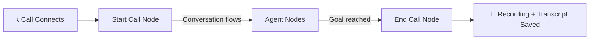

## What is a Voice Agent?

A **Voice Agent** is an AI-powered phone bot that can hold real, natural conversations with people — answering questions, collecting information, booking appointments, or handling support requests — entirely by voice, 24/7, without human intervention.

Under the hood, each agent is a **workflow**: a directed graph of conversation steps connected by conditions. The AI navigates this graph in real time based on what the caller says.



<Note>
On Lynq, "Agent" and "Workflow" refer to the same thing. The dashboard calls it an **agent**; the API calls it a **workflow**. They are interchangeable.
</Note>

---

## Step 1 — Open the Create Agent Form

Navigate to **Voice Agents** in the sidebar, then click **Create Agent**.

You will see a three-field form:

| Field | What it does |
|---|---|
| **Call Type** | Whether this agent handles incoming calls, makes outgoing calls, or both |
| **Use Case** | A short label for what the agent does (e.g. "Customer Support") |
| **Description** | Natural language description of the agent's job — this is used by the AI to generate your initial workflow |

<Tip>
The more specific your description, the better the generated workflow. Include tone, key tasks, and any must-cover topics. For example: *"You are a friendly customer support agent for Acme Corp. Greet callers warmly, identify their issue, and either resolve it or escalate to a human if it requires account access."*
</Tip>

### Call Type Options

<CardGroup cols={2}>
  <Card title="Inbound" icon="phone-arrow-down-left">
    The agent answers calls made **to** your phone number. Use this for customer support lines, booking hotlines, and IVR replacements.
  </Card>
  <Card title="Outbound" icon="phone-arrow-up-right">
    The agent **places calls** to a list of contacts. Use this for campaigns, follow-ups, appointment reminders, and lead qualification.
  </Card>
</CardGroup>

---

## Step 2 — Generate the Workflow

Click **Create Agent**. Lynq sends your description to the AI, which generates an initial conversation graph in seconds.

What happens behind the scenes:

```
Your description
      ↓
  AI generates workflow graph
      ↓
  Saved to your account
      ↓
  Workflow builder opens
```

You will land on the **Workflow Builder** — a visual canvas showing your generated agent as a connected graph of nodes.

---

## Step 3 — Understand the Workflow Canvas

The canvas is a drag-and-drop editor built on a node graph. Every agent has at minimum two nodes:

### Start Call Node

The **entry point** of every call. This node fires the moment a call connects. It contains:

- **Greeting Message** — the first thing your agent says when the call connects
- **System Prompt** — the AI's core instructions: personality, goals, constraints, knowledge
- **Allow Interruptions** — if on, the caller can interrupt the agent mid-sentence

<AccordionGroup>
  <Accordion title="Greeting Message — best practices">
    Keep greetings short and natural. The caller should know immediately who they reached and that they can speak.

    **Good:** *"Hello! Thanks for calling Acme Support. How can I help you today?"*

    **Avoid:** *"Welcome to the automated Acme Corporation customer service hotline. Please wait while your call is being connected to our AI system."*
  </Accordion>
  <Accordion title="System Prompt — what to include">
    Your system prompt is the agent's brain. Include:

    - **Identity**: Who the agent is and who it represents
    - **Goal**: What it should accomplish on this call
    - **Tone**: Formal, friendly, concise, empathetic
    - **Knowledge**: Key facts the agent needs (products, policies, FAQs)
    - **Boundaries**: What it should NOT do (e.g. never discuss pricing, always escalate billing issues)

    ```
    You are Alex, a friendly support agent for Acme Corp.
    Your goal is to help callers troubleshoot common product issues.
    Speak in a warm, professional tone. Keep responses concise.
    If the caller asks about refunds or billing, tell them you'll 
    transfer them to the billing team and end the call politely.
    ```
  </Accordion>
  <Accordion title="Allow Interruptions">
    When **on** (default), the caller can speak mid-response and the agent will stop and listen. This creates a more natural conversation.

    Turn **off** for legal disclaimers, compliance statements, or any content that must be delivered in full without interruption.
  </Accordion>
</AccordionGroup>

### End Call Node

Marks the point where the call terminates. When the workflow reaches this node, the call hangs up. You can configure:

- A closing statement for the agent to say before hanging up
- Variables to extract from the conversation (name, intent, outcome)

### Adding More Nodes

For more complex agents, you can add intermediate **Agent Nodes** between Start and End. Each Agent Node represents a distinct phase of the conversation (e.g. "Collect Name", "Qualify Budget", "Book Appointment").

Connect nodes by dragging an edge from one node's output handle to another node's input handle. Each edge carries a **condition** — natural language describing when the agent should move to the next node.

---

## Step 4 — Configure the Start Call Node

Click the **Start Call** node to open its configuration panel on the right side of the canvas.

Fill in:

1. **Greeting Message** — e.g. *"Hello! Thanks for calling. How can I help you today?"*
2. **Prompt** — the full system instructions for your agent
3. **Allow Interruption** — leave on for natural conversations

Click **Save** when done.

<Warning>
The Prompt field is required. An agent with an empty prompt will connect but the AI will have no context about its role and may respond unpredictably.
</Warning>

---

## Step 5 — Test with a Browser Call

You don't need a phone number to test your agent. Lynq includes a **WebRTC browser call** that lets you speak directly to your agent from your computer.

1. Click **Start Web Call** on the workflow detail page
2. Allow microphone access when prompted by the browser
3. Wait for the agent to greet you — it usually starts within 1–2 seconds
4. Have a conversation — speak naturally, interrupt if you want
5. Click **End Call** or just close the tab when done

<Note>
The browser call uses your real agent pipeline — the same AI, the same logic, the same voice. What you test is exactly what callers will experience.
</Note>

### What you'll hear

The agent is powered by **Gemini Live** — Google's native audio AI that handles speech recognition, reasoning, and voice synthesis in a single real-time connection. This means:

- No detectable latency between you speaking and the agent responding
- Natural, human-like voice (not robotic TTS)
- The agent understands context across the full conversation

---

## Step 6 — Review Recordings & Transcripts

After every call ends, Lynq automatically:

1. Saves the full audio recording as a `.wav` file
2. Saves the complete transcript as a `.txt` file
3. Stores both in your account's secure storage

Go to **Recordings** in the sidebar to see all past calls. Each entry shows:

- Workflow name
- Call date and duration
- Download links for audio and transcript
- Call status (completed, failed, etc.)

<Tip>
Use transcripts to improve your agent's prompt. Look for moments where the AI gave a wrong answer or went off-script — those are the gaps to address in your system prompt.
</Tip>

---

## The AI Pipeline

Here is exactly what happens during a browser call, from microphone to voice response:

```
Your microphone
      ↓
  WebRTC (encrypted audio stream)
      ↓
  Lynq server (api.lynq.naazailabs.com)
      ↓
  Gemini Live WebSocket
  ┌─────────────────────────────┐
  │  Speech → Text              │
  │  Text → LLM reasoning       │  ← all in one model, one connection
  │  Text → Speech              │
  └─────────────────────────────┘
      ↓
  Audio response streams back
      ↓
  Your speaker
```

**Why this matters:** Traditional voice bots chain three separate services (STT → LLM → TTS), each adding 200–500ms of latency. Gemini Live does all three natively, resulting in responses that feel instant and natural.

---

## Frequently Asked Questions

<AccordionGroup>
  <Accordion title="How many nodes can a workflow have?">
    There is no hard limit. Simple agents need only a Start and End node. Complex agents can have dozens of intermediate nodes for multi-step conversations, branching logic, and different user intents.
  </Accordion>
  <Accordion title="Can I edit the workflow after creation?">
    Yes. Open the workflow from **Voice Agents**, click **Edit**, and modify any node or connection. Changes take effect on the next call — ongoing calls use the version that was active when the call started.
  </Accordion>
  <Accordion title="Can the agent speak languages other than English?">
    Yes. Gemini Live supports 20+ languages including Hindi, Arabic, Spanish, French, and more. Instruct the agent in your system prompt to respond in the caller's language, or fix it to a specific language.
  </Accordion>
  <Accordion title="What is the difference between a workflow and a campaign?">
    A **workflow** defines the agent's behavior. A **campaign** uses a workflow to place a batch of outbound calls to a list of contacts. Think of the workflow as the script and the campaign as the execution.
  </Accordion>
  <Accordion title="Is the browser call the same as a real phone call?">
    The AI logic is identical. The transport differs — browser calls use WebRTC (internet audio), while phone calls use Twilio/telephony. The agent's voice, reasoning, and behavior are the same in both.
  </Accordion>
</AccordionGroup>

---

## Next Steps

<CardGroup cols={2}>
  <Card title="Connect a Phone Number" icon="phone" href="/integrations/telephony/twilio">
    Add a Twilio, Plivo, or Telnyx number so real callers can reach your agent.
  </Card>
  <Card title="Run an Outbound Campaign" icon="bullhorn" href="/core-concepts/campaigns">
    Upload a contact list and have your agent call hundreds of people automatically.
  </Card>
  <Card title="Add More Nodes" icon="sitemap" href="/voice-agent/editing-a-workflow">
    Build multi-step conversations with branching logic and variable extraction.
  </Card>
  <Card title="Configure the AI Model" icon="microchip" href="/configurations/inference-providers">
    Switch voice, language, or AI provider for your agent.
  </Card>
</CardGroup>
